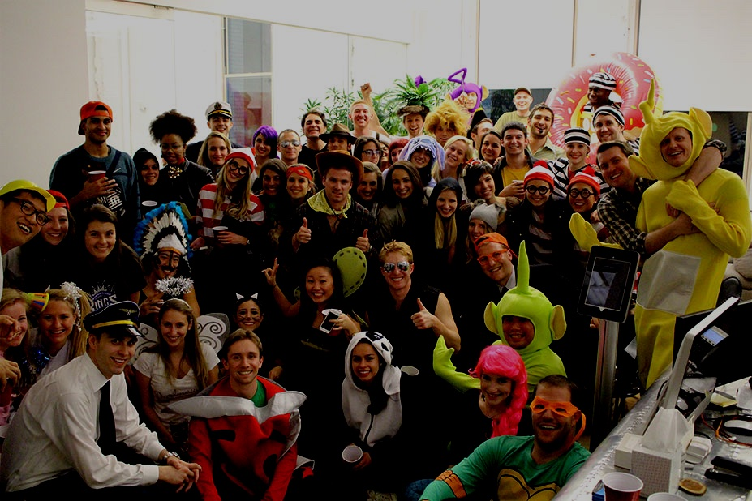
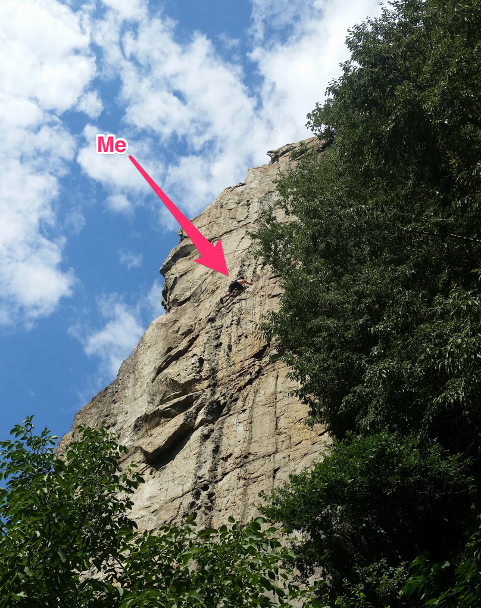
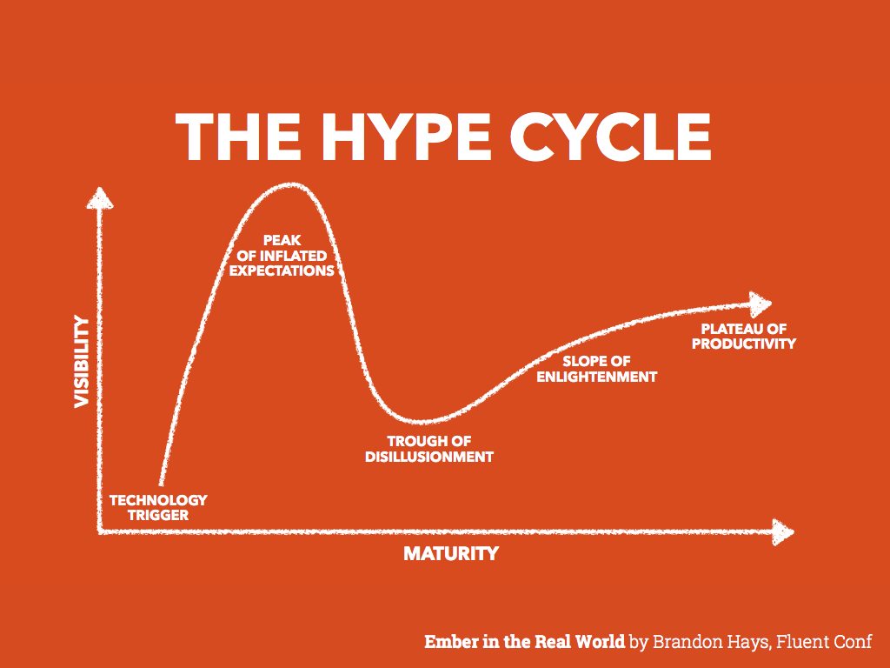
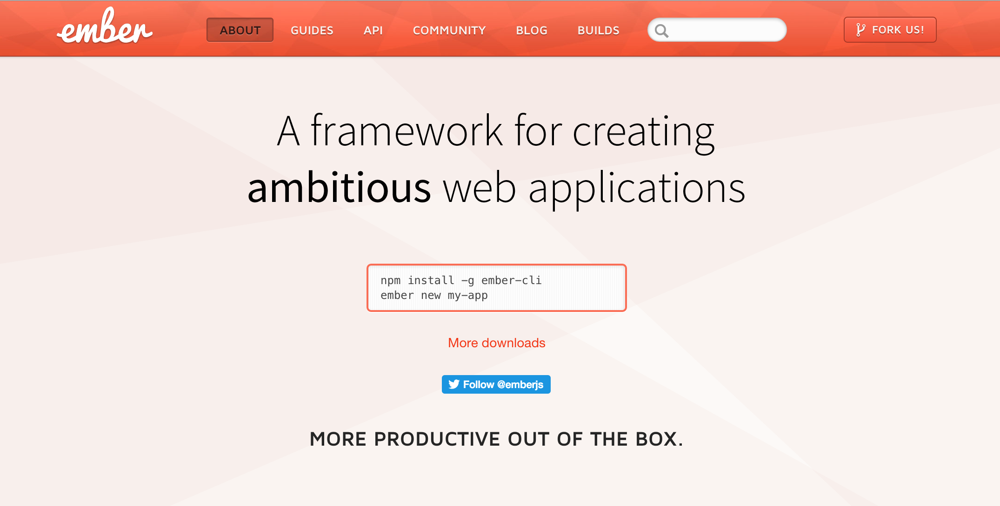

build-lists: true

# [fit] How I learned
# [fit] to **<3** Ember

---

# HI!

---

## I'm Ju 🙇🏻

---

You can find me as **@arkh4m**

---

I'm Italian 🇮🇹

---

# [fit] MAMMA MIA

---

I live in London 🇬🇧

---

---

I work at **AlphaSights**
We're huuuge Ruby & Ember fans!

---

I'm addicted to rock climbing

---

---

**A long time ago in a galaxy far,
far away....**

---

I was a PhD student working on
High Speed Networks Packet Processing

---

Friend: *"Hey, wanna join our Rails shop?"*

---

Me: *"OK"*

---

# [fit] PROBLEM

---

I knew nothing about web development.

---

So I started studying Ruby 

---

But that wasn't enough, so I studied **RoR**

---

But that wasn't enough, so I studied **OOP**

---

But that wasn't enough, so I studied **TDD**

---

And it was **good**.

---

# BUT THEN CAME THE JAVASCRIPT

---

So I learned *jQuery*

---

And it was **great**.

---

Then I learned *KnockoutJS*

---

And it was **awesome**.

---

Then I learned *BackboneJS*

---

And it was **revolutionary**.

---

Then I learned *MarionetteJS*

---

And it was **fantastic**.

---

Then I learned *BatmanJS*

---

And it was so **elegant**.

---

Then I learned *AngularJS*

---

And it was **mindblowing**.

---

# [fit] HYPE FATIGUE

---

---

I was pretty deep into **The Pit
of JavaScript Disillusionment**

---

You can imagine my reaction when
we chose Ember as our main frontend stack

---

---

*"Let's take a look.."*

---

# [fit] 1 minute later...

---

*"This looks nice..."*

---

# [fit] 5 minutes later...

---

*"This looks complicated...."*

---

# [fit] 10 minutes later...

---

---

# [fit] How I learned **Ember**

---

1. Introduction to Ember.js by Gaslight
2. Ember 101 by Adolfo Builes
3. From Rails to Ember
4. Balint Erdi's blog

---

# [fit] The 3 things you need to know

---

1. Rails Controllers != Ember Controllers
2. Nested Routes === Nested UI
3. Promises (I'm serious)

---

# [fit] Ember is a fast moving target

---

# [fit] Ember is a **FAST** moving target

---

There is new version of something every day!

---

1. Upgrade (ember|ember-data|ember-cli)
2. Fix deprecations
3. Rejoice!

---

1. Upgrade (ember|ember-data|ember-cli)
2. Everything is broken 0_0
3. All is lost

---

# [fit] DON'T PANIC

---

1. Read the error
2. Reread the error (for real)
3. Check out the release changelog
4. Ask on Slack (https://embercommunity.slack.com)

---

# [fit] OH BOY THE COMMUNITY

---

---

# [fit] SSS

---

# [fit] Second
# [fit] System
# [fit] Syndrome

---

> We're going to rebuild this from scratch

---

> It's going to be easier, faster, more expressive

---

> Oh, and it's not backwards compatible

---

# [fit] SWS

---

# [fit] Stability
# [fit] Without
# [fit] Stagnation

---

> Eventually all the good ideas will end up in Ember
-- wycats

---

When I was learning Ember, I was learning a piece of software.

---

But the truth is, there are many pieces of software around.

---

You could say: "This is my framework. There are many like it, but this one is mine."

---

But what I found is much more than a framework

---

It's a frame of mind.

---

It's having a true open source process

---

It's thinking about backwards compatibility all the time

---

And that's more important than the software to me.

---

# [fit] KISS

---

# [fit] Keep It Simple, Stupid

---

> Simple is better than complex
-- The Zen of Python

---

> But complex is better than complicated
-- The Zen of Python

---

---

An ambitious application solves a real problem

---

Reality is full of complexity

---

Our job is to manage complexity, not run away from it

---

Never use simplicity as an excuse :)

---

# Bibliography

* http://brewhouse.io/blog/2015/05/13/emberjs-an-antidote-to-your-hype-fatigue.html
* https://teamgaslight.com/training/courses/14
* https://leanpub.com/ember-cli-101
* http://fromrailstoember.com
* http://balinterdi.com
