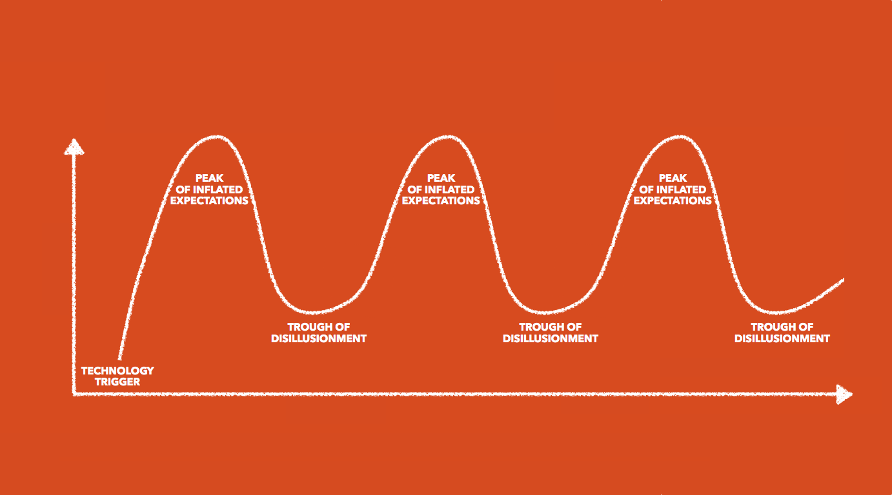

build-lists: true

# [fit] How I learned
# [fit] to **<3** Ember

---

# [fit] HI!

---

## I'm Ju 🙇🏻

---

You can find me as **@arkh4m**

---

I'm Italian 🇮🇹

---

# [fit] MAMMA BUTTA LA PASTA

---

I live in London 🇬🇧

---

---

I work at **AlphaSights**
We're in London and New York
And we're *huuuge* Ruby & Ember fans

---

I'm addicted to rock climbing!

---

---

I'm here to tell a story

---

**A long time ago in a galaxy far,
far away....**

---

*January 2011. Turin, Italy*

---

I was a PhD student working on
packet filtering in high speed networks

---

Friend: *"Hey, wanna join our Rails shop?"*

---

Me: *"OK"*

---

# [fit] PROBLEM

---

I knew nothing about web development.

---

So I started studying Ruby 

---

But that wasn't enough, so I studied **Rails**

---

But that wasn't enough, so I studied **OOP**

---

But that wasn't enough, so I studied **TDD**

---

And I was **happy**

---

I was really enjoying myself doing what every backend Ruby developer loves to do

---

# BUT THEN CAME THE JAVASCRIPT

---

So I learned *jQuery*

---

And it was **great**

---

Then I learned *BackboneJS*

---

And it was **amazing**

---

Then I learned *MarionetteJS*

---

And it was **fantastic**

---

Then I learned *BatmanJS*

---

And it was very **clever**

---

Then I learned *AngularJS*

---

And it was **revolutionary**

---

But I still wasn't **happy**

---

---

# [fit] THE APPLE EFFECT

---

# [fit] A9. The most advanced chip ever
# [fit] The most vivid Retina display ever
# [fit] TouchID faster and better than ever
# [fit] 3D Touch lets you do more than ever
# [fit] The most powerful 4-inch phone ever
# [fit] IOS 9 is smarter and more essential than ever
# [fit] The 27-inch iMac is faster and more powerful than ever

---

> When everything is revolutionary, probably nothing really is
-- Albert Einstein

---

# HYPE FATIGUE

---

---

I was pretty deep into
**The Pit of JavaScript Disillusionment**

---

But I had my Ruby, my OOP and my TDD

---

So everything was good!

---

**But one day..**

---

> We're going to rebuild this Rails app in Ember!

---

You can imagine my reaction..

---

---

*"Let's take a look.."*

---

*"This looks nice..."*

---

# [fit] 15 minutes later...

---

---

Even though I knew Rails, Ember looked like something completely different

---

And I wasn't a *huge* fan

---

# [fit] KISS

---

# [fit] Keep It Simple, Stupid

---

> Simple is better than complex
-- The Zen of Python

---

> Write programs that do one thing and do it well
-- Doug McIlroy

---

> Why do you have to go and make things so complicated?
-- Avril Lavigne

---

So what changed?

---

## Well, I learned **Ember**

---

1. Introduction to Ember.js by Gaslight
2. Ember 101 by Adolfo Builes
3. Balint Erdi's blog

---

## Then I built my first **serious** app

---

1. Ember CLI
2. Ember Data
3. Ember Addons
4. Promise-aware Testing

---

## And it made me **happy**

---

So what about KISS?

---

# [fit] The Gmail Test

---

> You have to rebuild Gmail. How do you do it?

---

> Simple is better than complex
-- The Zen of Python

---

> But complex is better than complicated
-- The Zen of Python

---

---

An ambitious application solves a **real** problem

---

And reality is full of complexity

---

Our job is to manage complexity,
not run away from it

---

> Everything should be made as simple as possible, but not simpler
-- Albert Einstein

---

Also I found out what I didn't like
about writing JavaScript

---

Wasn't the syntax

---

Nor handling state

---

Nor handling async

---

It was the **revolution at any cost** mentality

---

---

# [fit] SSS

---

# [fit] Second
# [fit] System
# [fit] Syndrome

---

> We need to rebuild this from scratch

---

> It's going to be easier, faster, more expressive

---

> But it's not gonna be backwards compatible

---

* Perl 5 -> Perl 6
* Python 2 -> Python 3
* Angular 1 -> Angular 2

---

# Intelligent design

---

> Natura non facit saltus
-- Linnaeus, 1751

---

# [fit] Stability
# [fit] Without
# [fit] Stagnation

---

> Eventually all the good ideas will end up in Ember
-- wycats

---

When I was learning Ember,
I was learning a piece of software.

---

But the truth is,
there are many pieces of software around.

---

> This is my framework. There are many like it, but this one is mine.

---

But what I found is much more than a framework

---

It's a frame of **mind**.

---

It's having a truly **open source** process

---

It's thinking about backwards compatibility

---

And to me, that's more important than the software

---

# Ember
## Evolution at Work

---

# Thank you!

@arkh4m

engineering.alphasights.com

---

# Bibliography

* http://brewhouse.io/blog/2015/05/13/emberjs-an-antidote-to-your-hype-fatigue.html
* https://teamgaslight.com/training/courses/14
* https://leanpub.com/ember-cli-101
* http://fromrailstoember.com
* http://balinterdi.com
