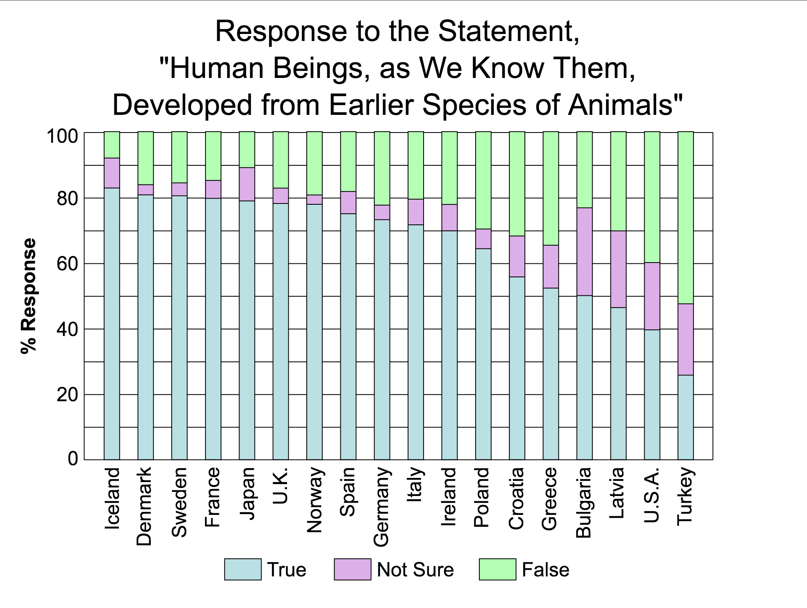

build-lists: true

# [fit] How I learned
# [fit] to **<3** Ember

---

# [fit] HI!

---

## I'm Ju 🙇🏻

---

You can find me as **@arkh4m**

---

I'm Italian 🇮🇹

---

# [fit] MAMMA BUTTA LA PASTA

---

I live in London 🇬🇧

---

---

I work at **AlphaSights**
We're in London and New York
And we're *huuuge* Ruby & Ember fans

---

I'm addicted to rock climbing!

---

---

I'm here to tell a story

---

**A long time ago in a galaxy far,
far away....**

---

I was a PhD student working on
packet filtering in high speed networks

---

Friend: *"Hey, wanna join our Rails shop?"*

---

Me: *"OK"*

---

# [fit] PROBLEM

---

I knew nothing about web development.

---

So I started studying Ruby 

---

But that wasn't enough, so I studied **Rails**

---

But that wasn't enough, so I studied **OOP**

---

But that wasn't enough, so I studied **TDD**

---

And I was **happy**

---

I was really enjoying myself doing what every backend Ruby developer loves to do

---

# BUT THEN CAME THE JAVASCRIPT

---

So I learned *jQuery*

---

And it was **great**

---

Then I learned *BackboneJS*

---

And it was **amazing**

---

Then I learned *MarionetteJS*

---

And it was **fantastic**

---

Then I learned *BatmanJS*

---

And it was very **clever**

---

Then I learned *AngularJS*

---

And it was **revolutionary**

---

But I still wasn't **happy**

---

---

# [fit] A9. The most advanced chip ever
# [fit] The most vivid Retina display ever
# [fit] TouchID faster and better than ever
# [fit] 3D Touch lets you do more than ever
# [fit] The most powerful 4-inch phone ever
# [fit] IOS 9 is smarter and more essential than ever
# [fit] The 27-inch iMac is faster and more powerful than ever

---

# HYPE FATIGUE

---

---

> When everything is revolutionary, probably nothing really is
-- Albert Einstein

---

I was pretty deep into
**The Pit of JavaScript Disillusionment**

---

But I had my Ruby, my OOP and my TDD

---

So everything was good!

---

**But one day..**

---

> We're going to rebuild this Rails app in Ember!

---

Initially I wasn't *really* excited

---

---

But then I start poking around...

---

*"This looks nice and familiar..."*

---

# [fit] 15 minutes later...

---

---

Even though I thought I knew Rails and JS,
Ember looked like something completely different

---

And I wasn't a *huge* fan because
it was doing **too many things**

---

# [fit] KISS

---

# [fit] Keep It Simple, Stupid

---

> Simple is better than complex
-- The Zen of Python

---

> Write programs that do one thing and do it well
-- Doug McIlroy

---

> Why do you have to go and make things so complicated?
-- Avril Lavigne

---

# [fit] 2 years later...

---

Now I love Ember :)

---

# [fit] I can do **everything!**

---

So what changed?

---

# [fit] The Gmail Test

---

> I have to rebuild Gmail. How would I do it?

---

---

I couldn't figure out a way to do it
by keeping it simple...

---

> Simple is better than complex
-- The Zen of Python

---

> But complex is better than complicated
-- The Zen of Python

---

---

An ambitious application solves a **real** problem

---

And as we know, reality is full of complexity

---

> Everything should be made as simple as possible, but not simpler
-- Albert Einstein

---

So I stopped using 'simplicity' as an excuse :)

---

Also, I found out why I wasn't enjoying myself in JS

---

It wasn't the syntax

---

It wasn't handling state

---

It wasn't handling async

---

But the **revolution at any cost**

---

---

# [fit] Second
# [fit] System
# [fit] Syndrome

---

> We need to rebuild this from scratch

---

> It's going to be easier, faster, more expressive

---

> But it's not gonna be backwards compatible

---

* Perl 5 -> Perl 6
* Python 2 -> Python 3
* Angular 1 -> Angular 2

---

# Intelligent design

---

> I have the perfect plan, now let's build it

---

---

> Natura non facit saltus
-- Linnaeus, 1751

---

# [fit] Stability
# [fit] Without
# [fit] Stagnation

---

> Eventually all the good ideas will end up in Ember
-- wycats

---

When I was learning Ember,
I was learning a piece of software.

---

But the truth is,
there are many pieces of software around.

---

> This is my framework. There are many like it, but this one is mine.
-- Full Metal Jacket

---

But what I learned to love is much more than a framework

---

It's a frame of **mind**

---

It's having a truly **open source** process

---

It's thinking about backwards compatibility

---

It's embracing **continuous mutation**
over short lived revolutions

---

## Don't be a Creationist.
## Learn to love **Ember!**

---

# Thank you!

 🙇🏻
 
@arkh4m

engineering.alphasights.com
